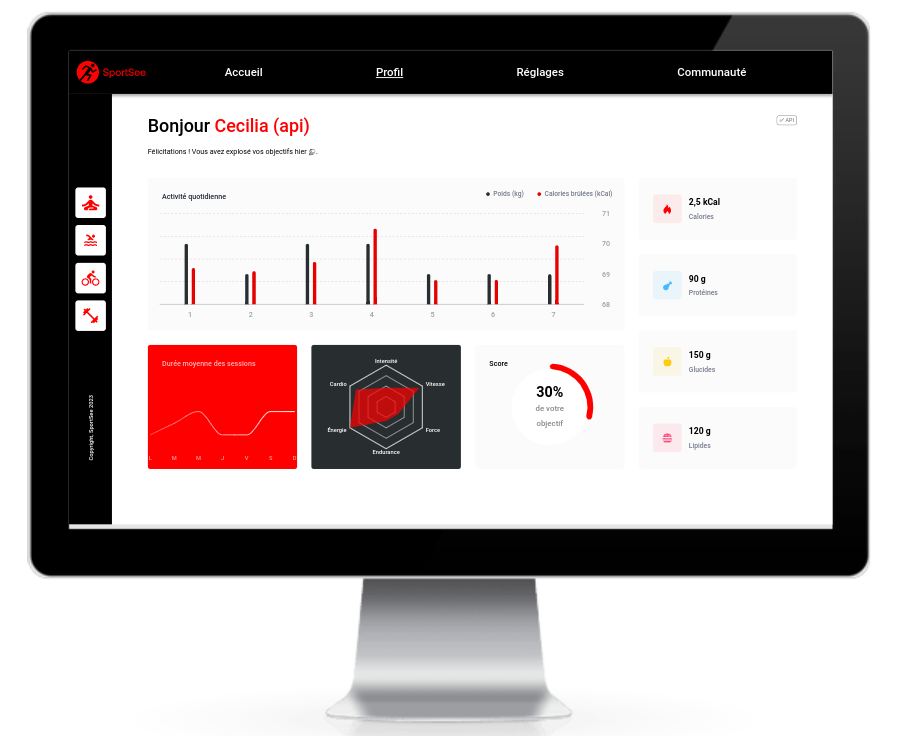

[](https://nodejs.org/)
[](https://vitejs.dev/)
[](https://reactjs.org/)
[](https://recharts.org/)
[](https://sass-lang.com/)

# oc-p12-sportsee 👋

This project is the n°12 in the [OpenClassrooms Front-End learning path](https://openclassrooms.com/fr/paths/516-developpeur-dapplication-javascript-react). It combines a backend and a client side. The backend is provided. It is a simple API which serve data to the client via GET endpoints.

**SportSee** is a virtual sport coaching company. I developped the profile page of their website. It is a dashboard where user's data (calories, kilograms, etc.) are displayed by different kinds of charts : line, bars, radial and radar. The profile get these data from the API or a mocked file.

## ✨ Demo

- [Website](https://jeromeabel.github.io/oc-p12-sportsee/) : the online API is quite slow !



## 🚨 Prerequisites

To get and build the project you will need to install :

- [NodeJS](https://nodejs.org/)
- [Yarn](https://yarnpkg.com/)
- A terminal to run commands. If you don't have one, I would recommend to use [Visual Studio Code](https://code.visualstudio.com/), it provides an integrated terminal inside the code editor.
- Optional : [Git](https://git-scm.com/)

## 🛠️ Installation

### Backend

As I've deployed the API online, you don't have to build it. Anyway, if you would like to run the project locally, you will need to follow the "./backend/README.md" file for more details. You might follow this instructions to install the backend :

```sh
$ cd backend
$ yarn install
```

### Client

Go to the client directory and install dependencies :

```sh
$ cd client
$ yarn install
```

## 🚀 Usage

### API

The API provides two user data sets with IDs 12 and 18. All the end points are documented in the "./backend/README.md" file.

- Online example : https://sportsee.onrender.com/user/18
- Local example : http://localhost:3000/user/18

### Online API

Launch the client with these commands :

```sh
$ cd client
$ yarn dev
```

And open your web browser to this address : http://localhost:5173/oc-p12-sportsee

### Local API

If you want to use the project locally, edit the file "./client/src/services/api/useUserApi.js". Comment the line 23 and uncomment line 22 as follow :

```js
const userUrl = new URL(userId, 'http://localhost:3000/user/'); // local
// const userUrl = new URL(userId, 'https://sportsee.onrender.com/user/'); // online
```

Launch the server

```sh
$ cd backend
$ npm run start
```

Launch the client as mentionned in the previous section.

## 🤝 Contributing

Consider this project as an exercice, but contributions, issues and feature requests are welcome! You can find the JS documentation in JSDOC format of the client in the "./client/docs/" folder.

Feel free to check the [issues page](https://github.com/jeromeabel/oc-p12-sportsee/issues).

## 👤 Authors

- Client side : [@jeromeabel](https://github.com/jeromeabel)
- Backend site : [OpenClassrooms-Student-Center](https://github.com/OpenClassrooms-Student-Center/P9-front-end-dashboard)

## 📝 Licenses

- Client side is [GNU--GPL--3](https://www.gnu.org/licenses/gpl-3.0.fr.html) licensed.
- Backend site is [MIT](https://www.mit.edu/~amini/LICENSE.md) licensed
